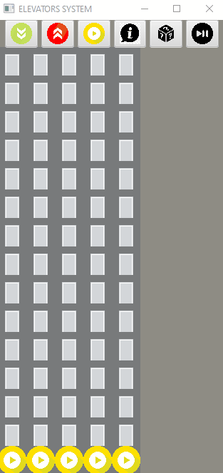

# Elevators system 
Simple 2d simulation that visualize a basic algorithm for controlling elevator group. Was made with the purpose of figure out an algorithm, as well as to broaden knowledge of Java nad JavaFX.

## Technologies

Project is created with:
* Java version: 14.0.2 
* JavaFX version: 15.0.1
* Gson version: 2.8.6

## Setup

To run this project using IntelliJ install necessary libraries and add VM options:
* Linux/Mac

```
--module-path /path/to/javafx-sdk-15.0.1/lib --add-modules javafx.controls,javafx.fxml
```
* Windows
```
--module-path "\path\to\javafx-sdk-15.0.1\lib" --add-modules javafx.controls,javafx.fxml
```

If you use another programming environment, refer to [link](https://openjfx.io/openjfx-docs/) for more information.

## Description  
Firstly we need to change the simulation parameters as number of elevators or floors by modifying parameters.json file. We are able to control simulation with control panel that contains buttons:


Using this buttons you can:
* order a pick up by choosing one of red and green buttons and defining one of floors with a click on proffered row.
* order a ride to a specific floor by choosing yellow button and clicking on preferred place.
* get information about current elevators task by choosing button with sign i and clicking on preferred elevator. The information will be showed in terminal. 
* begin generating random tasks by clicking on the button with question marks. Generator adds one pick up per step and when pick up is completed it also orders a ride to specific floor.
* start simulation by choosing start/pause button. You can also press s to make single simulation step.

## Algorithm 
It is a simple algorithm, where tasks are assigned to the elevator which maximum possible distance to reach the task is the shortest of all elevators.
While an elevator is performing tasks it changes direction only when all tasks in current direction are completed.  

## Visuals 




